# 📊 Análisis de Tasas de Interés y Oportunidades de Mercado

**Autor:** José Pablo García Meza  
**Periodo de análisis:** 2019–2024  

---

## Participación de Mercado

- En **noviembre de 2023**, Scotiabank alcanzó un **21.39% del mercado hipotecario**, consolidándose como un jugador intermedio frente a **BBVA** y **Banorte**.  
- Muestra una **tendencia general al alza** entre 2019 y 2024, con retrocesos leves al inicio de cada año.  
- El crecimiento sostenido se ha mantenido dentro de un rango del **7% al 9%**.

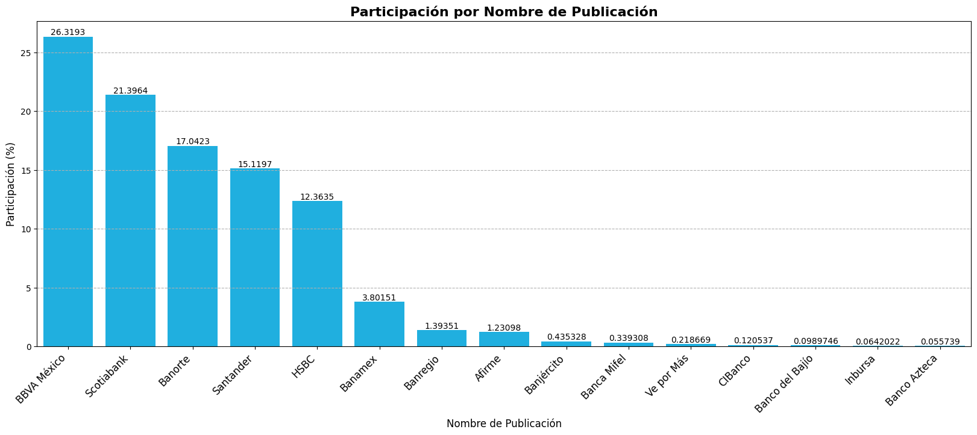

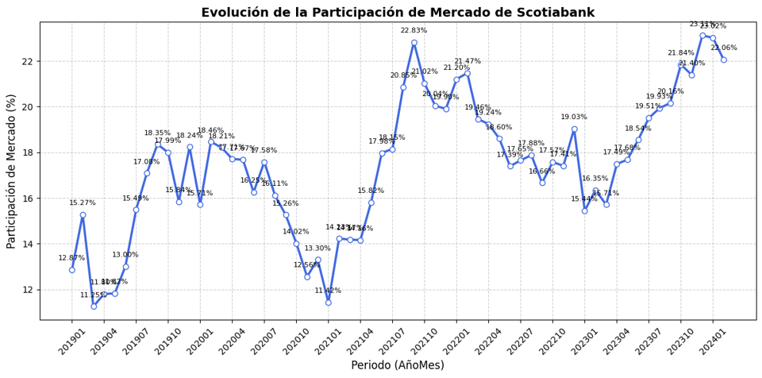

---

## Evolución Histórica

- Scotiabank ocupa el **tercer lugar** promedio en participación de mercado, detrás de BBVA y Banorte.  
- Durante **finales de 2023 e inicios de 2024**, Scotiabank **superó a Banorte** en participación de mercado.

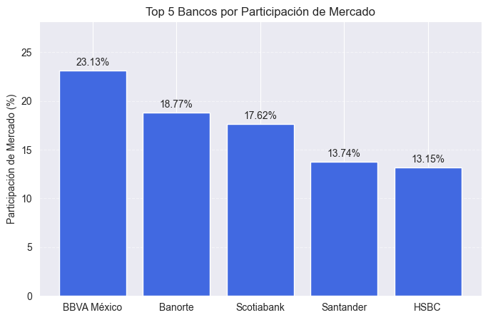

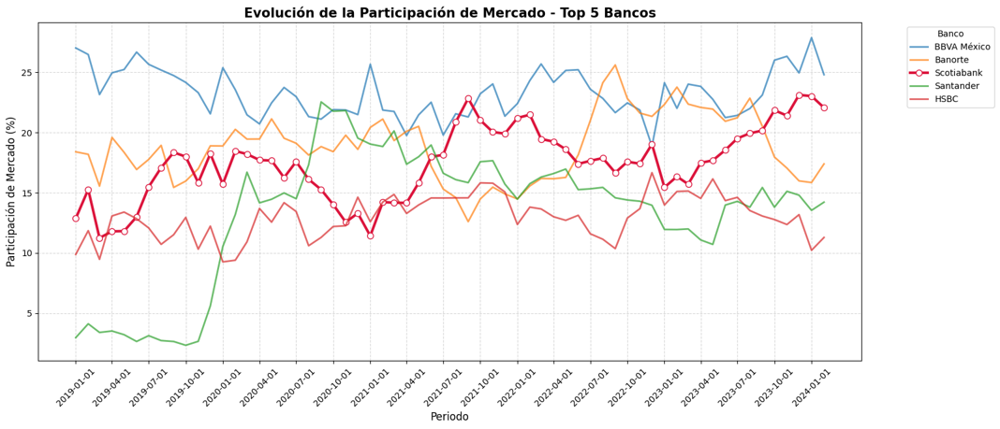
---

## Concentración Geográfica

- Scotiabank supera a BBVA en **solo 4 estados del país**.  
- Esto representa una **oportunidad de crecimiento en los 28 estados restantes**.  
- Los estados con **menor presencia** del banco son:
  - Baja California Sur  
  - Campeche  
  - Baja California  
  - Michoacán  
  - Hidalgo  
  
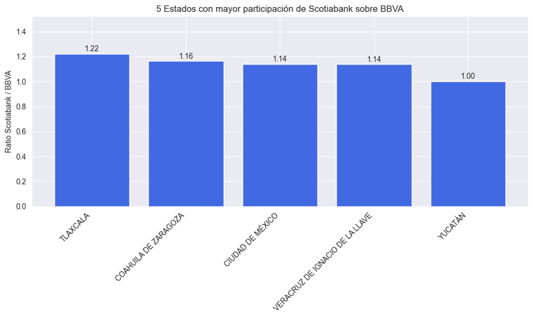

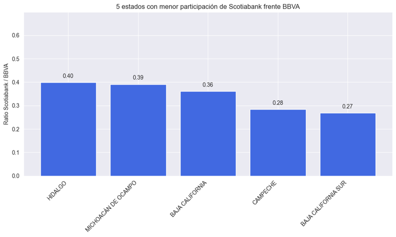
---

## Segmentos Desatendidos — *Por Edad*

- Mayor competitividad en los rangos de **35–54 años** y **55–74 años**.  
- Menor presencia en los segmentos:
  - **<34 años**  
  - **>75 años**  
- Los grupos **<34 años** representan una **alta densidad poblacional**, siendo el principal foco de oportunidad.

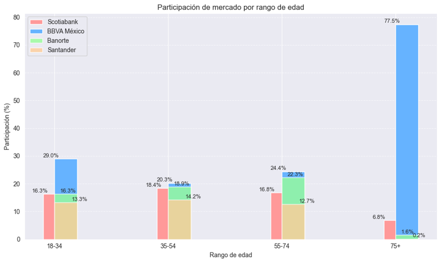

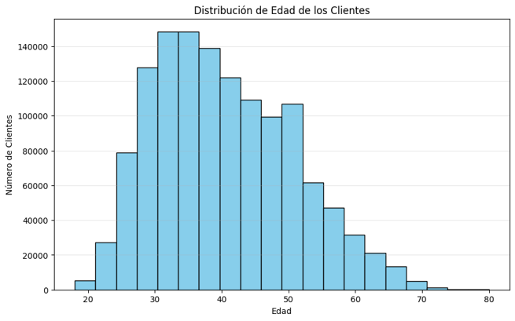
---

## Segmentos Desatendidos — *Por Ingreso*

- El banco muestra un **sesgo en el sector ≤22 mil pesos**, mientras que mantiene buena competitividad en los segmentos superiores.  
- El **sector <22 mil pesos** concentra la mayor densidad poblacional y es una **oportunidad sólida de expansión**.

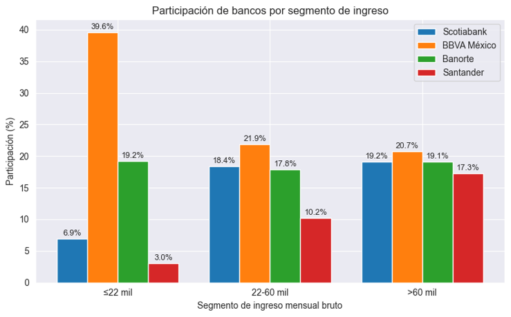

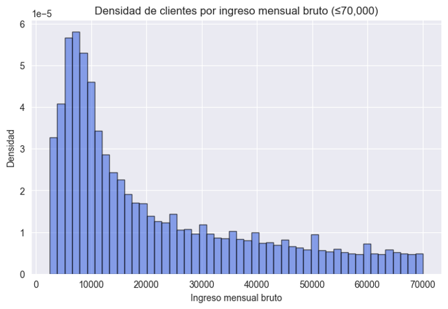
---

## Regiones con Tasas Promedio Más Altas

- Se identificaron cinco estados donde Scotiabank **cobra más que el promedio nacional**, y cinco donde **cobra menos**.  
- **Oportunidades de mejora:**
  - Aumentar tasas en regiones con diferencia negativa.  
  - Ajustar tasas a la baja en regiones con diferencia positiva para mejorar competitividad.

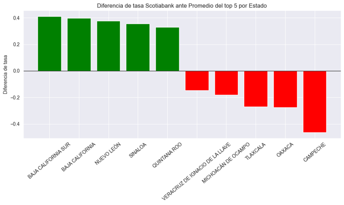
---

## ✅ Conclusiones

- Scotiabank se mantiene en la **segunda o tercera posición** del mercado hipotecario con **tendencia al alza**.  
- La **competencia domina más del 80%** de las regiones, lo que representa **un amplio margen de crecimiento**.  
- Principales oportunidades:
  - **Segmentos etarios <34 y >75 años**, con prioridad en el primero.  
  - **Sector de ingresos ≤22 mil pesos**, de alta concentración poblacional.  
  - **Estados con baja presencia** (especialmente Baja California y Baja California Sur), donde las tasas podrían ajustarse al promedio regional.
